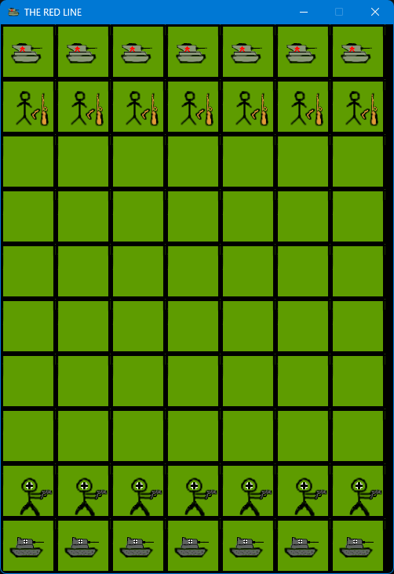

<br/>
<p align="center">
  <a href="https://github.com/Guille-ux/THE-RED-LINE">
    
  </a>

  <h3 align="center">The Red Line</h3>

  <p align="center">
    A war-themed game written with Python.
    <br/>
    <br/>
    <a href="https://github.com/Guille-ux/THE-RED-LINE"><strong>Explore the docs »</strong></a>
    <br/>
    <br/>
    <a href="https://github.com/Guille-ux/THE-RED-LINE">View Demo</a>
    ·
    <a href="https://github.com/Guille-ux/THE-RED-LINE/issues">Report Bug</a>
    ·
  </p>
</p>

    

## Table Of Contents

* [About the Project](#about-the-project)
* [Built With](#built-with)
* [Getting Started](#getting-started)
  * [Prerequisites](#prerequisites)
  * [Installation](#installation)
* [Contributing](#contributing)
* [License](#license)
* [Authors](#authors)
## About The Project



In "The Red Line" you will play the role of the Soviets. Your mission will be to lead them to victory against the Germans.
A game written entirely in Python, with its own sprites, music and sound effects.

## Built With

Game created entirely with Pyhton-

* [Python [Code]](https://www.python.org)
* [Gimp [Sprites]](https://www.gimp.org)
* [FL Studio 20 [Music]](https://www.image-line.com/fl-studio/)
* [bfxr [SFX]](https://www.bfxr.net)
* [Pygame [Code]](https://www.pygame.org)

## Getting Started

This is a guide to help you clone the source code of this game on your computer.

### Prerequisites

· You will need [Git](https://git-scm.com/book/en/v2/Getting-Started-Installing-Git).

### Installation

Open the administrator terminal in the folder where you want to save the source code and enter this command:

```sh
git clone https://github.com/Guille-ux/THE-RED-LINE/
```

## Contributing

The best way for you to contribute to the game is to [report bugs](https://github.com/Guille-ux/THE-RED-LINE/issues) that appear in your game.


## License

Distributed under the GNU License. See [LICENSE](https://github.com/Guille-ux/THE-RED-LINE/blob/main/LICENSE.md) for more information.

## Authors

* **Guille-ux** - *Creator of the game* - [Guille-ux](https://github.com/Guille-ux) - *Sprites, Music, SFX, very few code*
* **Nunte** - *Contributed to the game* - [Nunte](https://github.com/NunteGamer) - *Sprites, Music, SFX, very few code*
